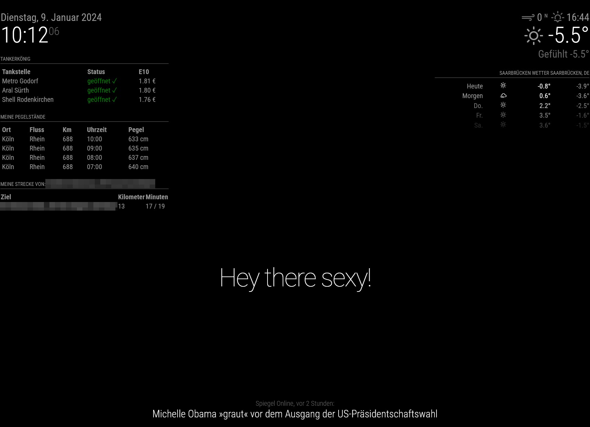

# MMM-Traffic
Bing Traffic situation on my route

## Installation
1.  Navigate into your MagicMirror's modules folder and execute git clone https://github.com/alfkoblischke/MMM-Trafic.git. A new folder will appear navigate into it.
2.  Edit your configuration file under `config/config.js` with the following configuration.

## Cofiguration
Please configure in config.js.

```
{
    module: 'MMM-Traffic',
    position: 'top_left',
    config: {
        apiKey: "xxxxxx", // get apiKey at: https://www.bingmapsportal.com
        start: "Start Address",
        destination: "Destination Address",
    }
}
```


## Update
Navigate into your MMM-Traffic folder .../modules/MMM-Traffic and execute git pull.

## Api Key
To get an apiKey, login at: https://www.bingmapsportal.com and apply for it.
